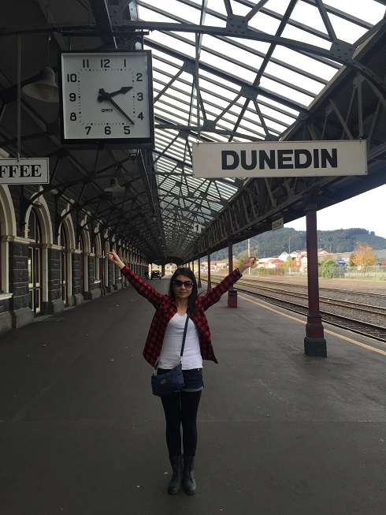

Tingting Tao / 陶婷婷
ITer，程序媛。喜欢IT技术，旅游和体育运动。
这里是我的小家，写自己的故事，和感兴趣的技术。
接受现实，并忠于理想。

I am a software engineer.
I am passionate about IT techniques, currently obsessed with distributed systems. I had experiences in payments backend services development and UX development(both desktop and mobile), believe in data-driven decision making, including A/B testing, user engagement data mining and analysis. I am happy to use or learn different programming languages and trying to be language-agnostic.
In my free time I like to go to gym, doing cardio or weight training, my goal is always be fit enough to run 10k. Go healthy!
Apart from that, I am also keen to travel to different places.
Keep going! you go girl!

